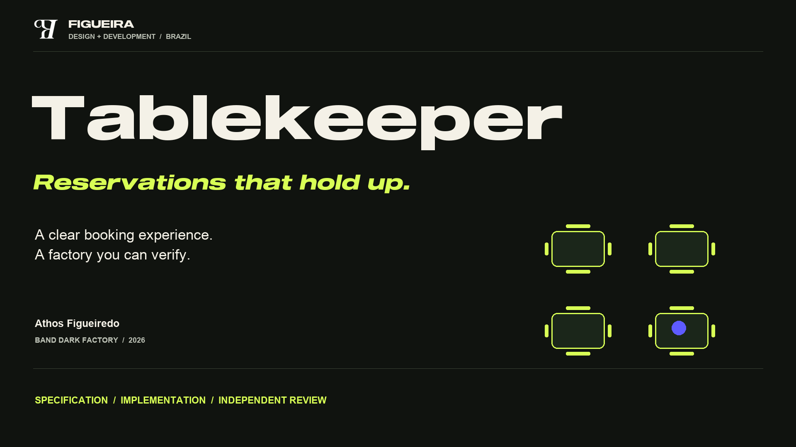

# Figueira Dark Factory — Tablekeeper



Owner: Athos Figueiredo, Figueira, Brazil. Track: Tablekeeper.

This repository contains four cumulative, standalone service folders produced by the three-seat Figueira Band factory. Each folder preserves the solution to its own stage. The original history and generic mandates remain intact.

All four stages are independently ready locally. The final complete isolated package run passed every applicable shipped suite: 120/120, 145/145, 152/152 and 158/158 cumulative tests for folders 1–4, respectively. Independent review additionally exercised behavior beyond those partial shipped checks, including real defects that were repaired. Exact results and limits are in the stage reports.

| Folder | Delivered scope | Source revision |
|---|---|---|
| [Stage 1](stage-1/RUN.md) | JSON API, authentication, atomic reservations/moves, retries, time zones and portable state | `0f96bf0cd889959d134ca6f8a5ee3066bbe459f8` |
| [Stage 2](stage-2/RUN.md) | Browser booking/lookup, approved combined tables, stale-state and lost-response recovery | `2e026c006569b2e749de79b7526f03ae9b6e44e3` |
| [Stage 3](stage-3/RUN.md) | Effective-dated policies, immutable accepted terms/history, revisions and recurring agreements | `4b7b0620f3dd645fac18d840a6d612e8f4c6bed6` |
| [Stage 4](stage-4/RUN.md) | Deterministic closure preview/application and atomic recurring amendments; current seating in confirmations | `8c6df7f369f0041798abf8de0e10c0babf501df5` |

Run the latest complete service from the repository root:

```sh
docker build -t tablekeeper-stage-4 stage-4
docker run --rm --name tablekeeper-stage-4 --cpus=2 --memory=2g -e PORT=8080 -p 8080:8080 tablekeeper-stage-4
```

Open `http://localhost:8080`. Browser routes are `/`, `/signup`, `/login` and `/lookup`. `GET /health` returns `{"status":"ok"}`. Each earlier folder can be built and run by substituting its stage number. Each image contains all required runtime dependencies/assets and listens on 0.0.0.0; no sibling service or outbound network is required. State is ephemeral and starts empty. Restaurants, tables and optional synthetic accounts are supplied through the specified `POST /_test/reset` fixture endpoint. Policy, recurring and manager operations are API capabilities; no extra administration screens are claimed.

- [Factory](FACTORY.md): actual identities, reusable procedure, measured time/cost limits and genuine review/repair decisions.
- [Plan](plan.md): complete acceptance map, interpretations, baselines and outcomes.
- [Stage 1 report](STAGE-1-REPORT.md), [Stage 2 report](STAGE-2-REPORT.md), [Stage 3 report](STAGE-3-REPORT.md), [Stage 4 report](STAGE-4-REPORT.md): exact source trees, independent/official local results and evidence.
- [Mandates](mandates/): original generic seat instructions, unchanged.

Evidence copies and original provenance are in [evidence/](evidence/). Historical reports retain the original local paths; use the matching stage subfolder here. The genuine full BAND download is [room.json](room.json), with its export timestamp and SHA-256 in [PACKAGING.json](evidence/PACKAGING.json). No edits or replacement log were made. Per-seat token usage and monetary spend are unavailable, not estimated.

Local verification is not official judging or submission. This publication preserves the accepted agent-authored source and history. A later operator packaging commit adds public evidence, the room export and presentation materials; it does not change the service or mandates. The competition portal confirms submission separately.

## See it and try it

- [Watch the 90-second demonstration (English MP4)](presentation/Tablekeeper-Video-EN.mp4)
- [English captions (SRT)](presentation/Tablekeeper-Captions-EN.srt)
- [Presentation (English PDF)](presentation/Tablekeeper-Presentation-EN.pdf)
- [Run the real service with a synthetic fixture](docs/DEMO.md): `bash docs/run-demo.sh`
- [Final independent delivery audit](evidence/stage-4/reviewer-delivery-audit-03/report.md)
- [Stage 4 review and whole-package results](evidence/stage-4/reviewer-final-report.md)
- [Full exported factory record](room.json)

The narrated demonstration uses actual BAND and application recordings, with timelapse labeled. Narration is AI-generated using Envato; visual direction and presentation are by Athos Figueiredo. No performance or model-spend figure is invented.


## Verification of the public clone

After publication, a fresh unauthenticated clone at `d191febc6e06337f75f570fdce2ad0dd3679307e` passed the unchanged official `harness check` and `harness run --all --mode isolated` (exit 0, 304.647 seconds total). Every folder claims its own stage. Original [receipt](evidence/final-public-verification/verification-receipt.json), [summary](evidence/final-public-verification/harness/summary.json) and per-suite counts are preserved. This is an operator verification after autonomous acceptance. Later presentation/evidence additions do not change any accepted stage tree or mandate.
